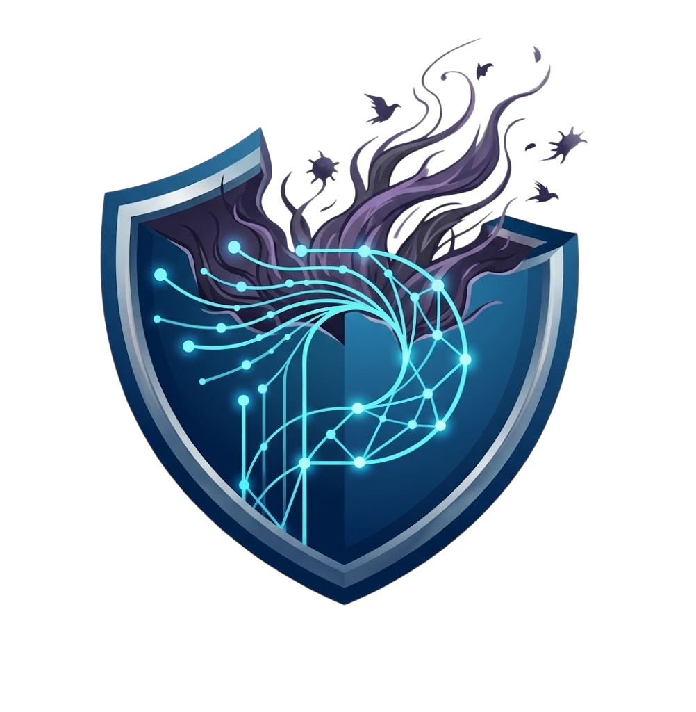

# Pandora Shield


<p align="center">
  
</p>

**Pandora Shield** è un laboratorio *vulnerable-by-design* (spin-off di TeleExpert AR) che simula il terminale operativo di una clinica supportato da un'Intelligenza Artificiale (**Pandora**) per l'analisi dei referti. 

L'obiettivo è dimostrare empiricamente l'intero ciclo di vita di un attacco informatico (Red Teaming) e la relativa mitigazione (Blue Teaming), esplorando l'intersezione tra vulnerabilità web tradizionali e le nuove superfici d'attacco dei Large Language Models (LLM).

## 🎯 Obiettivi Accademici

Questo laboratorio permette di esplorare, sfruttare e mitigare le seguenti criticità:
- **SQL Injection (SQLi):** Bypass dell'autenticazione tramite iniezione booleana nel portale di login.
- **Stored DOM-XSS:** Esecuzione persistente di codice client-side tramite vulnerabilità web ibrida.
- **OWASP LLM02:** Inquinamento del database via *Direct Prompt Injection* e *Insecure Output Handling*.
- **Evasione Payload:** Bypass dell'interferenza semantica (allucinazioni AI) tramite offuscamento in Base64.
- **Session Hijacking & Data Breach:** Furto dei token ed esfiltrazione silente dei dati sanitari via API REST.
- **Blue Teaming (IPS):** Blocco dinamico delle minacce via `iptables` tramite analisi log in tempo reale.
- **SSH Brute Force:** Sfruttamento della mancanza di Rate Limiting infrastrutturale tramite Hydra.

## 🌐 Topologia di Rete e Ruoli
L'infrastruttura è suddivisa in 3 componenti:
-  **Ubuntu** (server ospedaliero): ospita l'infrastruttura Pandora Shield e i container Docker.
-  **MacOS**/**Windows** (vittima): simula il medico che accede alla dashboard per consultare le diagnosi.
-  **Kali Linux** (attaccante): postazione da cui vengono effettuati gli attacchi.

## 🛠️ Stack Tecnologico

L'infrastruttura è containerizzata e isolata per garantire una riproducibilità sicura dei test.

* **Frontend:** HTML5, CSS3, Vanilla JavaScript.
* **Backend:** Node.js con framework Express.
* **Database:** SQLite3 (Serverless, ideale per ambienti di test).
* **Motore AI:** Ollama (Modello: `phi3:latest`).
* **Infrastruttura di Rete:** Nginx (Reverse Proxy) e Docker Compose.

---

## 🐳 Configurazione e Avvio tramite Docker

L'intero ambiente è gestito tramite Docker Compose, che orchestra il server Node.js, il motore AI e il reverse proxy. 

### Prerequisiti
- [Docker](https://docs.docker.com/get-docker/) installato sulla macchina host.
- [Docker Compose](https://docs.docker.com/compose/install/) installato.
- Almeno 8GB di RAM (necessari per far girare fluidamente il modello LLM in locale).

### Step di Installazione

**1. Clona il repository**
```bash
git clone <link_repo>
cd pandora-shield
```
**2. Avvia l'infrastruttura (nel folder del progetto)**
```bash
  sudo systemctl start docker
  docker compose up --build -d
```
L'applicazione sarà accessibile all'indirizzo `https://localhost` della macchina che ospita il server (è necessario accettare il certificato auto-firmato generato per l'ambiente di test).

## 🛡️ Attivazione delle Difese (Blue Team)
Per abilitare il rilevamento e il blocco automatico degli attacchi, è necessario avviare l'Intrusion Prevention System (IPS) customizzato sull'host Ubuntu.

**1. Pulizia della Baseline (Opzionale ma consigliata prima dei test)**
Svuota i log per evitare rumore di fondo durante l'analisi:
```bash
sudo truncate -s 0 /var/log/access.log
sudo truncate -s 0 /var/log/error.log
sudo truncate -s 0 /var/log/auth.log
```
In alternativa, puoi aprire i file di log direttamente nel tuo editor, cancellare il testo e salvare.  
**Attenzione**: questa operazione deve essere eseguita a container Docker rigorosamente spenti
**2. Avvio script di difesa**
```bash
sudo python3 pandora_hids.py
```
### ⚔️ Esecuzione degli Attacchi (Red Team)
Il repository include i file necessari per testare le difese direttamente da una macchina attaccante (es. Kali Linux):
* **Listener HTTPS:** Nella cartella `/kali` è presente lo script `listener.py` e i certificati auto-firmati per intercettare il token di sessione aggirando la *Mixed Content Policy*.
* **Wordlist per Brute Force:** Il file `passwords.txt` pre-compilato (sempre presente nella cartella `/kali`) permette di validare l'attacco SSH (Hydra) contro l'host fisico e testare la risposta dell'IPS in `/var/log/auth.log`.
___
## ⚠️ Disclaimer Legale ed Etico
Questo progetto è stato sviluppato esclusivamente per **scopi educativi e accademici**. L'applicazione contiene vulnerabilità **intenzionali** e critiche (SQLi, XSS, configurazioni insicure).
NON esporre mai questo container su una rete pubblica o su server in produzione. L'autore non si assume alcuna responsabilità per l'uso improprio delle tecniche qui documentate.
